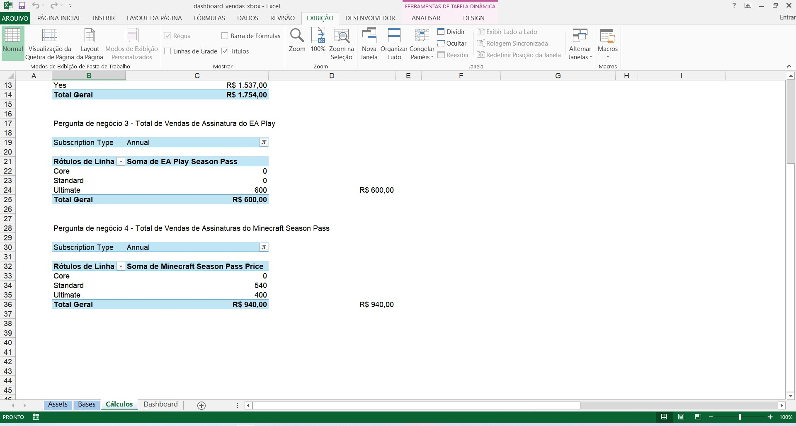
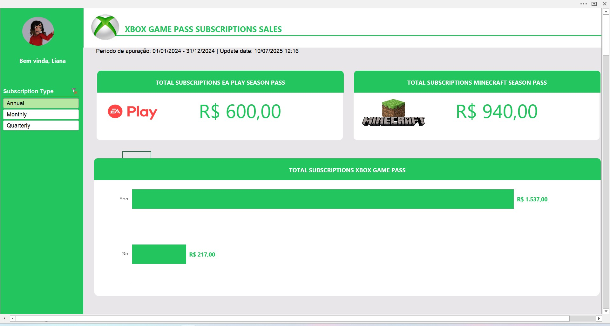

# 🌐 Repositório do desafio Dashboard de Vendas
### O desafio:
> "O desafio é criar um dashboard de vendas, com foco na organização e visualização de dados. O objetivo é transformar dados brutos em informações visuais claras e úteis, permitindo uma análise eficaz do desempenho de vendas e a tomada de decisões baseadas em dados."

###  🎯 Objetivo
> Criar um dashboard de vendas no Excel
>  

### Dashboard
> 💡 Um <strong>Dashboard </strong> é uma interface visual que apresenta informações, indicadores e métricas de desempenho de forma organizada e interativa. Ele serve como uma ferramenta para monitorar, analisar e compreender dados relevantes, geralmente de áreas <strong> específicas de um negócio</strong>.

### ❓Perguntas de negócio
<ul> 
  <li>Pergunta de negócio 1 - Qual faturamento Total de vendas de planos anuais (contendo todas as assinaturas agregadas)</li>
  <li>Pergunta de negócio 2 - Qual faturamento Total de vendas de planos anuais, separado por auto renovação ou que não é por auto renovação</li>
  <li>Pergunta de negócio 3 - Total de Vendas de Assinatura do EA Play </li>
  <li>Pergunta de negócio 4 - Total de Vendas de Assinaturas do Minecraft Season Pass </li>
</ul>

## Estrutura da planilha 📑

O arquivo Excel é composto por 3 planilhas utilizando o método que o especialista Felipe informou durante o Bootcamp (o método ABCD, criado por ele)
<ul>
  <li>A - Assets (são imagens, paletas de cores e outros recursos que estarão no dashboard.</li>
  <li>B - Bases (são as tabelas de dados onde serão extraídas as informações.</li>
  <li>C - Cálculos </li>
  <li>D - Dashboard</li>
</ul>

### <strong><ins> Planilha de Assets </ins></strong>

### <stronng><ins> Planilha de Bases <ins></strong>

### <strong><ins> Planilha de cálculos </ins></strong>

### <stron><ins> Planilha do Dashboard </ins></strong>

